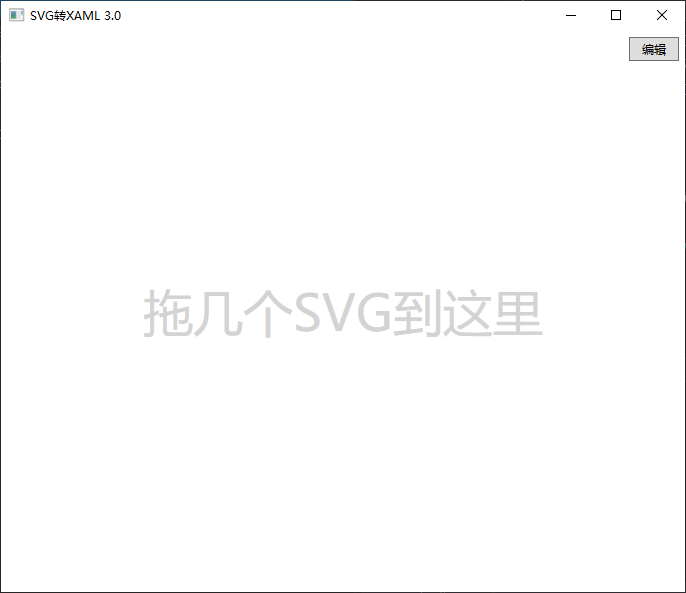
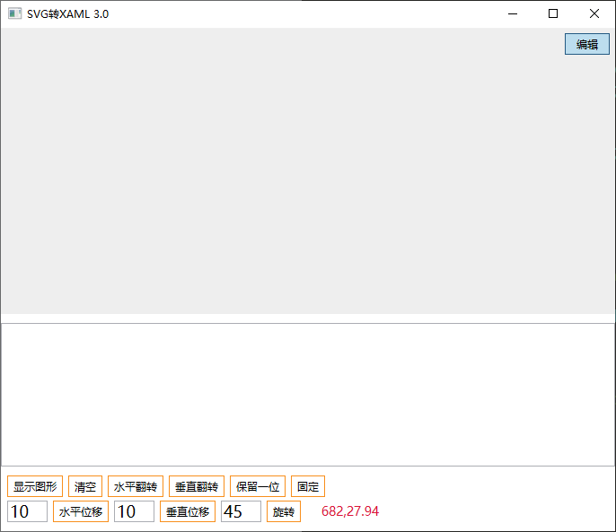

# dotnetCampus.Svg2XamlTool

| Build | NuGet |
|--|--|
||[](https://www.nuget.org/packages/dotnetCampus.Svg2XamlTool)|

拖入 SVG 文件，即可转换为 XAML 可用代码



提供简单的编辑功能



## 安装

```
dotnet tool install -g dotnetCampus.Svg2XamlTool
```

## 使用

```
Svg2Xaml
```

## 作者

[@fujinxiang](https://github.com/fujinxiang)

注：[@lindexi](https://github.com/lindexi/) 只是搬运工具人

## 第三方引用

- SharpVectors https://github.com/dotnet-campus/SharpVectors